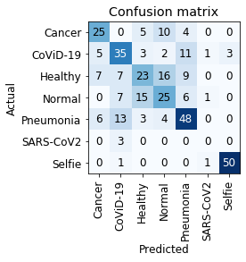

# Lungs X-ray classifier
by [Teo de Campos](https://cic.unb.br/~teodecampos/)

This is just a **toy experiment** to see how to deploy a [Fast.AI](https://www.fast.ai/) model with Voilà.

I used a [ResNet34](https://arxiv.org/abs/1512.03385) model pre-trained on [ImageNet classifier](http://www.image-net.org/) which was adapted (through "transfer learning") for a small set of images downloaded using [Microsoft Bing Internet Search API](https://azure.microsoft.com/en-us/services/cognitive-services/bing-web-search-api/). 

To build this toy dataset for fine tuning, I used the following search terms (each treated as a class):
1. X-ray of lungs with SARS-CoV2
1. cancer lungs x-ray
1. covid-19 lungs x-ray
1. healthy lungs x-ray
1. normal lungs x-ray
1. pneumonia lungs x-ray
1. selfie 

Obviously some labels actually refer to the same class. The class "selfie" is my background class, i.e., it's expected that a sample that does not contain an X-ray image of the lung will be classified as "selfie".

A total of 1134 images were obtained, of which 80% was used for training and the remaining for validation. Fine tuning was done for 10 epochs, giving the error rate of 41.55% and confusion matrix below:

Even if classes with the same meaning are grouped, this is clearly **not** a great result, so it illustrates how challenging this problem is, particularly when dealing with a small and noisy dataset. **The training set was not curated**, I just used whatever Bing Search gave, i.e., **this is NOT a serious experiments for CoVid-19 detection**. 

A decent work with proper training samples labeled by experts is being developed by my colleague [Flavio Vidal](https://cic.unb.br/~fbvidal/) and his team, see [Projeto XRAI at https://x-rai.redes.unb.br/](https://x-rai.redes.unb.br/).
